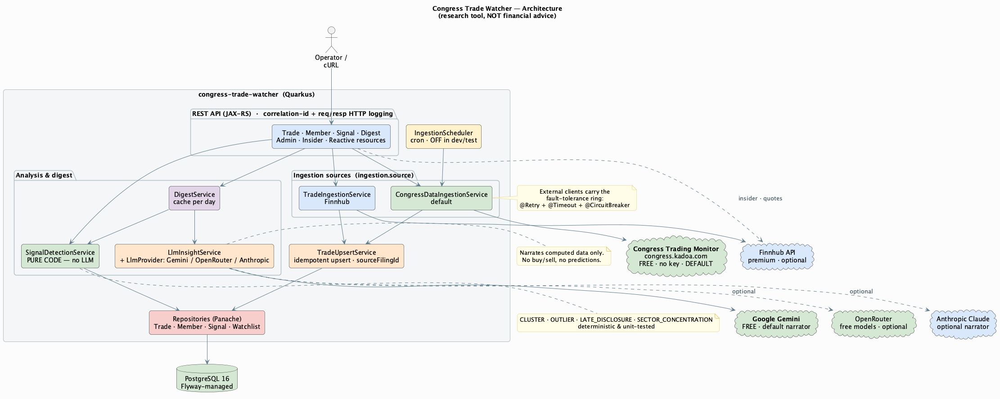
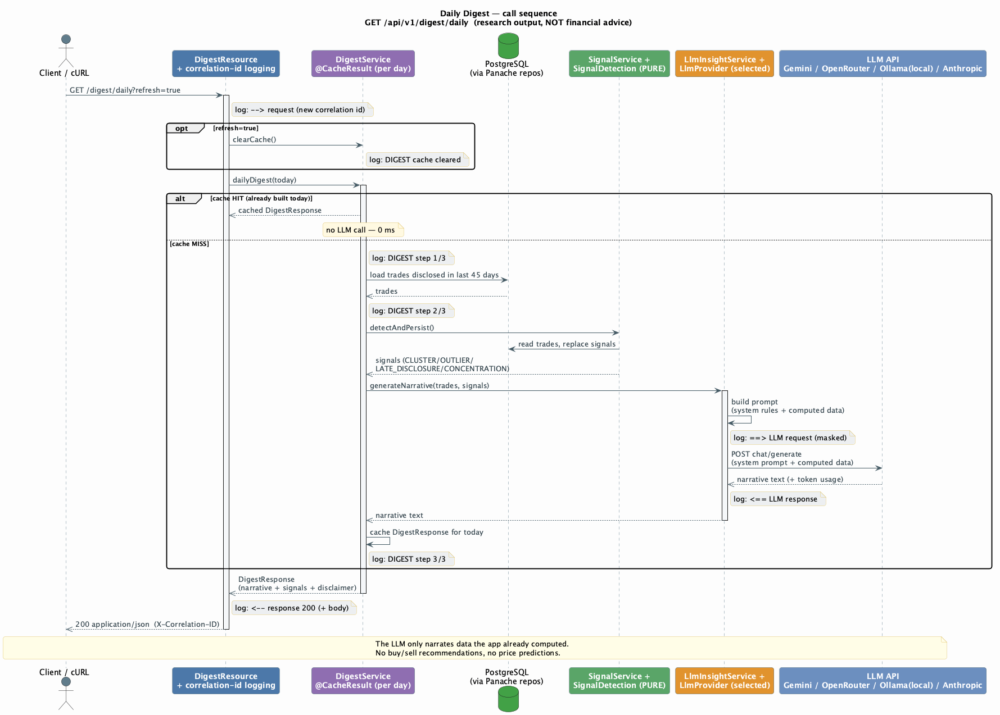
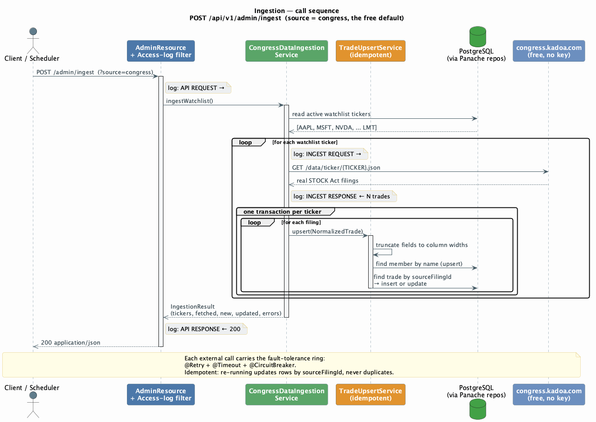
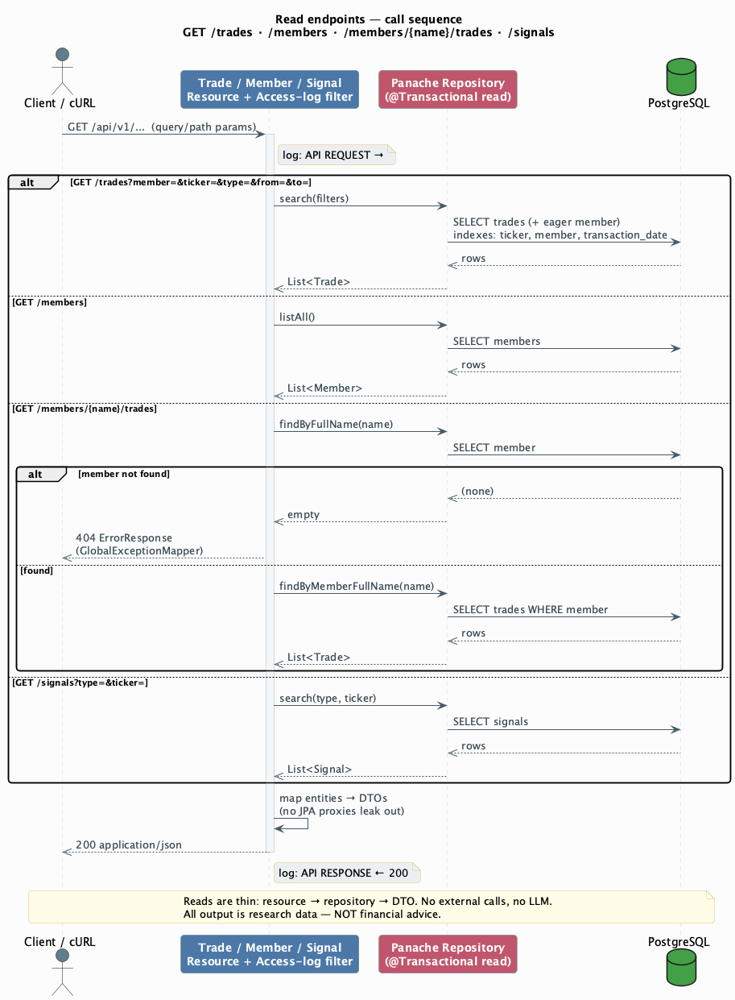
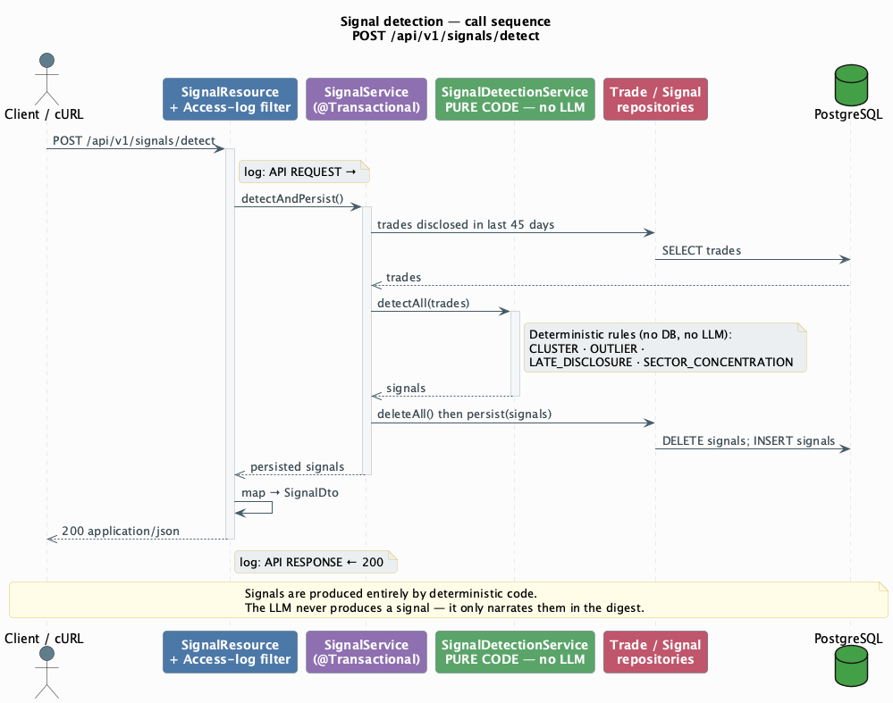

# Congress Trade Watcher

A Quarkus 3 application that ingests US Congressional stock-trade disclosures
(STOCK Act filings), persists and analyses them in **PostgreSQL**, detects
rule-based research patterns in pure code, and generates a plain-English daily
digest with an LLM.

Both the data source and the LLM are **pluggable**, and the defaults are **free
and need no paid key**: real disclosures from the open **Congress Trading Monitor**
dataset (congress.kadoa.com), narrated by **Google Gemini**. Finnhub (data) and
Anthropic Claude (narration) are optional alternatives.

> ## ⚠️ This is a research and learning tool — NOT financial advice
>
> Congressional trades are disclosed **up to 45 days late**, amounts are reported
> only as **broad ranges** (e.g. $1,001–$15,000), not exact figures, and following
> these trades **does not reliably beat the market**. The signals here surface
> patterns for human research only. The LLM is used **solely to summarise and
> contextualise** data the app has already computed — never to pick stocks or
> predict prices. Do your own due diligence and consult a licensed professional
> before making any investment decision.

---

## Requirements

- **Java 17** — the build compiles with `release 17` (JDK 21 also works fine).
  On JDKs newer than the extensions officially support (e.g. 25), Hibernate's
  ByteBuddy needs its *experimental* flag; that is pre-wired in `.mvn/jvm.config`
  and the Surefire/Failsafe config, so `./mvnw verify` still runs there too.
  `quarkus:dev` and IDE runs fork a JVM that does **not** inherit `.mvn/jvm.config`,
  so on JDK 25 add `-Dnet.bytebuddy.experimental=true` to the run config (or just
  use JDK 21).
- **Docker** + **Docker Compose** (PostgreSQL, and Testcontainers for the test suite).
- Maven is **not** required — use the bundled `./mvnw` wrapper.

## Quick start

```bash
# 1. One free key — Gemini (the default data source needs no key). Never committed.
cp .env.example .env
#    put GEMINI_API_KEY=...  in .env   (https://aistudio.google.com/apikey)

# 2. Start PostgreSQL
docker compose up -d

# 3. Build, run tests (Testcontainers + WireMock — no real API calls), and package
./mvnw verify

# 4. Run the app in dev mode (live reload, scheduler off, auto-loads .env)
./mvnw quarkus:dev

# 5. Pull real disclosures into Postgres, then read the LLM digest
curl -X POST "http://localhost:8080/api/v1/admin/ingest"
curl "http://localhost:8080/api/v1/digest/daily"
```

The API is then at <http://localhost:8080>, with:

- **Swagger UI**: <http://localhost:8080/q/swagger-ui>
- **OpenAPI**: <http://localhost:8080/q/openapi>
- **Health**: <http://localhost:8080/q/health> (readiness includes a DB check)

### Setting the environment variables

Only **one** key is required for a full run — a Gemini key for the digest. The
default trade-data source needs **no key**.

| Variable             | Required? | Where to get it                          | Used for                                       |
|----------------------|-----------|------------------------------------------|------------------------------------------------|
| `GEMINI_API_KEY`     | yes (for digest) | https://aistudio.google.com/apikey | Digest narration (default provider, free tier) |
| `OPENROUTER_API_KEY` | optional  | https://openrouter.ai/keys               | Digest narration if `LLM_PROVIDER=openrouter` (free models) |
| `ANTHROPIC_API_KEY`  | optional  | https://console.anthropic.com → API Keys | Digest narration if `LLM_PROVIDER=anthropic`   |
| `FINNHUB_API_KEY`    | optional  | https://finnhub.io → Dashboard → API Keys | Only if you ingest with `?source=finnhub` (premium endpoint) |

The narration provider is selectable via `LLM_PROVIDER` (`gemini` — default, free
— `openrouter`, or `anthropic`). The trade-data source is selectable via `INGESTION_SOURCE`
(`congress` — default, free, no key — or `finnhub`). All keys are referenced in
`application.properties` as `${...}` and read from the environment. **No secret is
ever stored in a properties file.**

> **Finnhub note:** Finnhub's congressional-trading endpoint requires a paid plan
> (a free key returns HTTP 403), which is why the free `congress` source is the
> default.

## Trigger ingestion manually (dev)

The scheduler is **disabled in dev** so local runs never auto-hit the external
APIs. Trigger ingestion yourself:

```bash
# Ingest the whole seeded watchlist from the free open dataset (default source)
curl -X POST "http://localhost:8080/api/v1/admin/ingest"

# Ingest a single symbol
curl -X POST "http://localhost:8080/api/v1/admin/ingest?ticker=AAPL"

# Use Finnhub instead (requires a paid FINNHUB_API_KEY)
curl -X POST "http://localhost:8080/api/v1/admin/ingest?source=finnhub"
```

In `%prod` the scheduler runs on `ingestion.cron` (default every 30 minutes).

## API endpoints & sample requests

```bash
# Trades — filter by member, ticker, type (PURCHASE|SALE|EXCHANGE), date range
curl "http://localhost:8080/api/v1/trades"
curl "http://localhost:8080/api/v1/trades?ticker=AAPL&type=PURCHASE"
curl "http://localhost:8080/api/v1/trades?member=Pelosi&from=2026-01-01&to=2026-06-01"

# Members  (use an exact full name from /members for the second call)
curl "http://localhost:8080/api/v1/members"
curl "http://localhost:8080/api/v1/members/Rohit%20Khanna/trades"

# Signals (clusters / outliers / late disclosures / concentration)
curl "http://localhost:8080/api/v1/signals"
curl "http://localhost:8080/api/v1/signals?type=CLUSTER&ticker=AAPL"
curl -X POST "http://localhost:8080/api/v1/signals/detect"   # re-run detection

# Daily digest — LLM narrative + structured signals + disclaimer (cached per day)
curl "http://localhost:8080/api/v1/digest/daily"
curl "http://localhost:8080/api/v1/digest/daily?refresh=true"  # bypass cache, force a fresh LLM call

# Reactive (Mutiny) demo endpoints
curl "http://localhost:8080/api/v1/reactive/trades?ticker=AAPL"          # Uni<List<TradeDto>>
curl -N -H "Accept: text/event-stream" \
     "http://localhost:8080/api/v1/reactive/tickers"                     # Multi<String> as SSE

# Insider transactions — corporate insiders (SEC Form 3/4/5) via Finnhub.
# Live passthrough (not persisted); requires FINNHUB_API_KEY. symbol is required.
curl "http://localhost:8080/api/v1/insider-transactions?symbol=TSLA&from=2026-01-01&to=2026-06-05"
```

> **Blocking vs reactive:** the app is intentionally **blocking** (Hibernate ORM
> Panache over JDBC). `ReactiveDemoResource` shows the Mutiny `Uni`/`Multi` style
> for the read path, offloading the blocking JDBC work to the worker pool with
> `runSubscriptionOn(...)` so the event loop is never blocked.

## Architecture

### Diagrams

Sequence diagrams cover **every REST endpoint**:

| Diagram | Endpoint(s) | Source | Rendered |
|---|---|---|---|
| Component / architecture | — | [`.puml`](docs/architecture.puml) · [`.drawio`](docs/architecture.drawio) | [png](docs/architecture.png) |
| Daily digest | `GET /digest/daily` | [`.puml`](docs/sequence-digest.puml) | [png](docs/sequence-digest.png) |
| Ingestion | `POST /admin/ingest` | [`.puml`](docs/sequence-ingestion.puml) | [png](docs/sequence-ingestion.png) |
| Read endpoints | `GET /trades` · `/members` · `/members/{name}/trades` · `/signals` | [`.puml`](docs/sequence-query.puml) | [png](docs/sequence-query.png) |
| Signal detection | `POST /signals/detect` | [`.puml`](docs/sequence-signals-detect.puml) | [png](docs/sequence-signals-detect.png) |



**Daily digest** (mirrors the `API/DIGEST/LLM REQUEST/RESPONSE` log lines):



**Ingestion:**



**Read endpoints (trades / members / signals):**



**Signal detection:**



> PNGs are rendered from the `.puml` sources with PlantUML
> (`java -jar plantuml.jar docs/*.puml`); regenerate them if you change a `.puml`.

### Layering

- **api** — JAX-RS resources + DTOs + exception mapping. No business logic.
- **service** — all logic. `SignalDetectionService` is **pure code** (no DB/LLM)
  and fully unit-tested; the LLM only narrates its output.
- **client** — `@RegisterRestClient` typed clients with fault tolerance.
- **repository** — Panache repositories.
- **domain** — Panache entities (public fields) + enums.

## How it works

1. **Ingestion** is pluggable (`ingestion.source`). The default
   `CongressDataIngestionService` fetches each watchlist ticker's real filings
   from the free congress.kadoa.com dataset; `TradeIngestionService` does the same
   from Finnhub. Both normalise records and persist them idempotently through the
   shared `TradeUpsertService`, keyed on a stable `sourceFilingId`.
2. **Signal detection** (`SignalDetectionService`, pure code — no DB, no LLM) finds:
   `CLUSTER`, `OUTLIER`, `LATE_DISCLOSURE`, `SECTOR_CONCENTRATION`.
3. **Digest** (`DigestService` + `LlmInsightService`) builds a structured prompt
   from the computed trades/signals and asks the configured `LlmProvider` (Gemini
   by default; OpenRouter or Anthropic optional) to write a neutral briefing. The result is
   cached per day so repeated calls don't re-bill the LLM (use `?refresh=true` to
   force a fresh call).

## Configuration knobs

| Property / env | Default | Effect |
|---|---|---|
| `INGESTION_SOURCE` / `ingestion.source` | `congress` | Trade source: `congress` (free) or `finnhub` |
| `LLM_PROVIDER` / `watcher.llm.provider` | `gemini` | Digest narrator: `gemini` (free), `openrouter` (free models), or `anthropic` |
| `watcher.gemini.model` | `gemini-flash-latest` | Gemini model |
| `watcher.gemini.thinking-budget` | `0` | `0` disables 2.5-series "thinking" (avoids truncated output) |
| `watcher.signals.*` | see properties | Thresholds for each signal rule |
| `ingestion.cron` | every 30 min (`off` in dev/test) | Scheduler cadence |

## Observability / logging

Every request is assigned a **correlation id** (the `[........]` field in each log
line, also returned as the `X-Correlation-ID` response header, and reused if you
send that header in). All lines of one call share it, so they group together. Per
call you get, at INFO:

```
[8c99a937] [n.c.k.c.http] --> GET /api/v1/insider-transactions?symbol=TSLA&from=2026-05-01
[8c99a937] [n.c.k.c.ext]  ==> GET https://finnhub.io/api/v1/stock/insider-transactions?symbol=TSLA&token=***
[8c99a937] [n.c.k.c.ext]  <== 200 GET https://finnhub.io/... (1144ms)
[8c99a937] [n.c.k.c.ext]  <== response body: {"data":[{"name":"Taneja Vaibhav", ...
[8c99a937] [n.c.k.c.http] <-- 200 GET /api/v1/insider-transactions?... (1195ms)
[8c99a937] [n.c.k.c.http] <-- response body: {"symbol":"TSLA","count":5, ...
```

- `-->` / `<--` = inbound (our API); `==>` / `<==` = outbound (Finnhub/Gemini/etc).
- **Secrets are always masked** — `token`/`apikey`/`key` query params become `***`
  and auth headers (`x-api-key`, `X-goog-api-key`, `Authorization`) are never logged.
- Response bodies are logged, **capped** at `watcher.logging.payload-max-chars`
  (default 2000; set to `0` to disable body logging).
- In `%dev` the app package logs at DEBUG (full LLM prompts, etc.).

## Testing

```bash
./mvnw verify   # 22 in-JVM tests (Surefire) + 3 integration tests (Failsafe)
```

The full testing pyramid:

- **Unit** — `SignalDetectionServiceTest`: plain JUnit, one per rule, no Quarkus.
- **`@QuarkusTest`** (in-JVM, Surefire) — `TradeResourceTest` (REST Assured over the
  full app + Testcontainers Postgres, both data sources) and `LlmInsightServiceTest`
  (WireMock stands in for Gemini/Anthropic; the real APIs are **never** called).
- **`@QuarkusIntegrationTest`** (packaged jar, Failsafe) — `AppSmokeIT`: black-box
  HTTP smoke test (health, ingest → trades/members, signal detection) against the
  built artifact, the way it runs in production.
- **Dev Services** — `%test` sets no JDBC URL, so Quarkus auto-starts a
  Testcontainers Postgres for both the `@QuarkusTest`s and the IT.

All external HTTP (congress.kadoa.com, Finnhub, Gemini, Anthropic) is mocked via
WireMock; Postgres is provided by Quarkus Dev Services (Testcontainers). **No real
external calls happen in tests.**

> The Quarkus 3.15 BOM pins Testcontainers 1.20.1, which can't negotiate with very
> recent Docker engines; this project overrides it to **1.21.4** in `pom.xml`. If
> Testcontainers can't find your Docker socket, set
> `DOCKER_HOST=unix://$HOME/.docker/run/docker.sock`.

## Database UI (optional)

```bash
docker compose --profile tools up -d   # pgAdmin at http://localhost:5050
```

## Data sources & honesty

- **Congress Trading Monitor** open dataset (default, free, no key):
  <https://congress.kadoa.com> — real STOCK Act filings parsed from the official
  House Clerk, Senate eFD, and OGE portals. Source repo (MIT):
  <https://github.com/kadoa-org/congress-trading-monitor>. Static snapshots, so
  the data is real but not continuously live. Thanks to the kadoa-org maintainers.
- Finnhub Congressional Trading (optional, premium): <https://finnhub.io/docs/api/congressional-trading>
- Google Gemini API (default narrator): <https://ai.google.dev/api/generate-content>
- Anthropic Messages API (optional narrator): <https://docs.anthropic.com/en/api/messages>

This project exists to **learn** and to **research disclosure patterns**, not to
generate trading signals. Treat every output accordingly.
